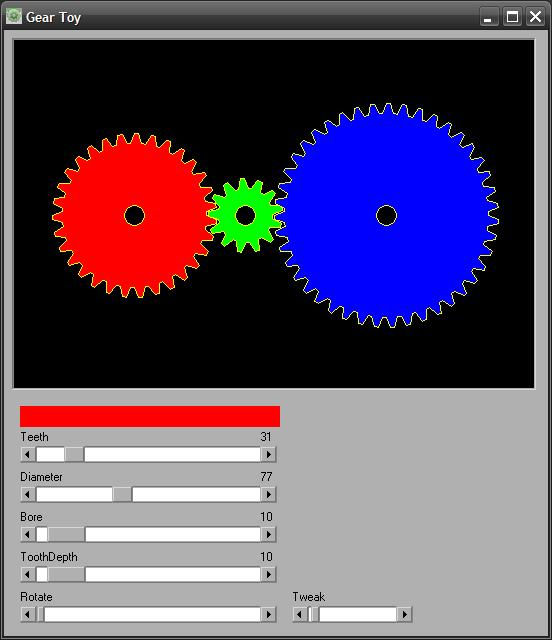



## Gear Toy

### Description

Gear simulation! You select a gear (by clicking the very center of it) and adjust the parameters. Spin the gears with the Rotate slider. Based on Gear-Box by Emilio P.G. Ficara http://www.planet-source-code.com/vb/scripts/ShowCode.asp?txtCodeId=73622&lngWId=1
 
### More Info
 

             |
---                |---
**Submitted On**   |2010-12-22 10:53:50
**By**             |[Paul Bahlawan](https://github.com/Planet-Source-Code/PSCIndex/blob/master/ByAuthor/paul-bahlawan.md)
**Level**          |Beginner
**User Rating**    |5.0 (15 globes from 3 users)
**Compatibility**  |VB 5\.0, VB 6\.0
**Category**       |[Complete Applications](https://github.com/Planet-Source-Code/PSCIndex/blob/master/ByCategory/complete-applications__1-27.md)
**World**          |[Visual Basic](https://github.com/Planet-Source-Code/PSCIndex/blob/master/ByWorld/visual-basic.md)
**Archive File**   |[Gear\_Toy21949812222010\.zip](https://github.com/Planet-Source-Code/paul-bahlawan-gear-toy__1-73647/archive/master.zip)

